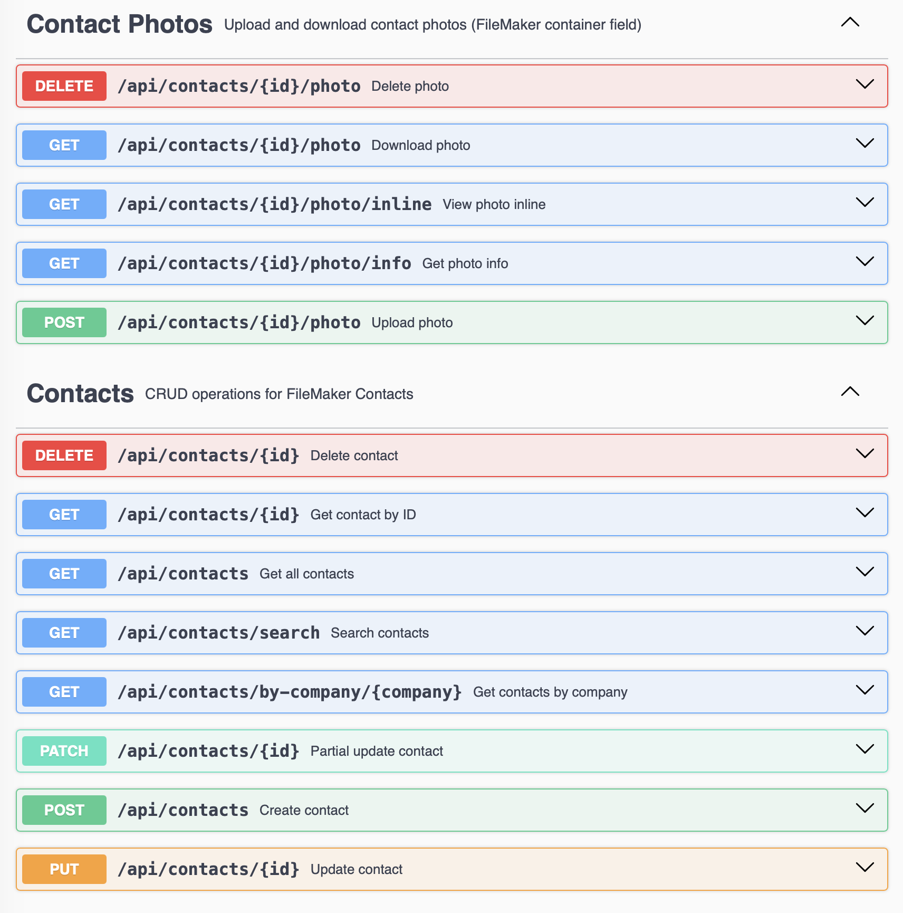

# FileMaker Hibernate 6.5+ Demo API

[](./coverage-badge.svg)
[](https://github.com/fsans/filemaker-demo-api)
[](https://spring.io/projects/spring-boot)
[](https://hibernate.org/)
[](https://help.claris.com/en/jdbc-odbc-guide/)
[](https://openjdk.org/)
[](https://opensource.org/licenses/MIT)

REST API demo for testing the FileMaker Hibernate 6.5+ Dialect with Spring Boot.

This demo app provides a full CRUD REST API with FileMaker Container field data management against a Contacts database. It serves as the companion test project for [FileMakerHibernate6](https://github.com/fsans/FileMakerHibernate6).




## Prerequisites

> If you need help building local maven repos, follow my gist about that matter: https://gist.github.com/fsans/289ee4c592da54fbcff4122a7142bd90

1. **FileMaker JDBC Driver** installed in local Maven repo:
   ```bash
   cd ../FileMakerHibernate6
   ./maven_deploy_driver.sh 22.0.1
   ```

2. **FileMaker Dialect** installed in local Maven repo:
   ```bash
   cd ../FileMakerHibernate6
   ./maven_deploy_dialect.sh 22.0.1
   ```

3. **FileMaker Server** running with the `Contacts` database accessible

## Configuration

Edit `src/main/resources/application.yml` to set your FileMaker connection:

```yaml
spring:
  datasource:
    url: jdbc:filemaker://YOUR_HOST/YOUR_DATABASE
    username: YOUR_USERNAME
    password: YOUR_PASSWORD
```

## Running the Application

### Development Mode

```bash
mvn spring-boot:run
```

### Production Deployment

#### Generate JAR Package

```bash
mvn clean package
```

This will create an executable JAR file in the `target/` directory:

- `target/filemaker-demo-api-1.0.0.jar`

#### Run the JAR File

```bash
java -jar target/filemaker-demo-api-1.0.0.jar
```

Or with specific JVM options:

```bash
java -Xmx512m -Xms256m -jar target/filemaker-demo-api-1.0.0.jar
```

The application will start on `http://localhost:8080` by default.

## API Endpoints

Once running, access:

- **Swagger UI**: http://localhost:8080/swagger-ui.html
- **OpenAPI JSON**: http://localhost:8080/api-docs

### Available Endpoints

#### Contact Management

| Method | Endpoint | Description |
|--------|----------|-------------|
| GET | `/api/contacts` | List all contacts (paginated) |
| GET | `/api/contacts/{id}` | Get contact by ID |
| GET | `/api/contacts/search?q=` | Search contacts |
| GET | `/api/contacts/by-company/{company}` | Get contacts by company |
| POST | `/api/contacts` | Create new contact |
| PUT | `/api/contacts/{id}` | Update contact |
| PATCH | `/api/contacts/{id}` | Partial update |
| DELETE | `/api/contacts/{id}` | Delete contact |

#### Photo Management (FileMaker Container Fields)

| Method | Endpoint | Description |
|--------|----------|-------------|
| POST | `/api/contacts/{id}/photo` | Upload photo to contact's container field |
| GET | `/api/contacts/{id}/photo` | Download contact's photo (as attachment) |
| GET | `/api/contacts/{id}/photo/inline` | View contact's photo inline in browser |
| DELETE | `/api/contacts/{id}/photo` | Delete contact's photo from container field |
| GET | `/api/contacts/{id}/photo/info` | Get photo information (content type, reference, availability) |

**Photo Endpoint Parameters:**

- `format` (optional): Image format for download/view (JPEG, PNGf, GIFf, PDF, TIFF)
- `file` (required for upload): Multipart file data

## Testing with Postman

Import the Swagger spec from `http://localhost:8080/api-docs` into Postman for easy testing.

## Stack

- Spring Boot 3.2
- Spring Data JPA
- Apache DBCP2 (connection pool - HikariCP is not compatible with FileMaker JDBC)
- FileMaker Hibernate Dialect
- SpringDoc OpenAPI (Swagger)
